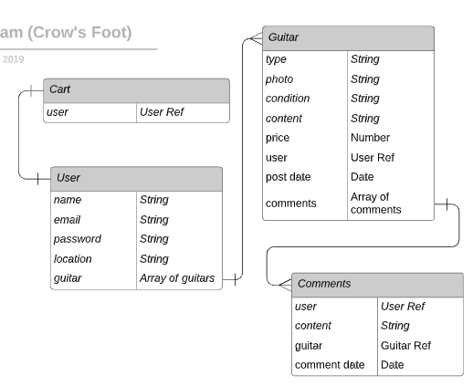
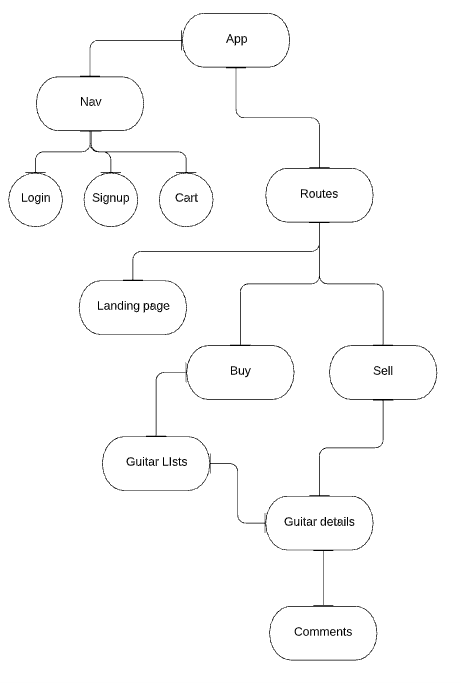

## GuitarHub
[link to GuitarHub on Heroku](https://guitar-hub-frontend.herokuapp.com/)

## About GuitarHub
* GuitarHub is a buy, sell, trade platform for guitar fanatics. Users can create an account, shop the marketplace, or post guitars for sale on their profile page. Filter guitars based on name or price range. Details page gives information on the guitar such as, price, current condition, location of the seller and a breif description. 

## Technologies 
* MERN (mongoDB, Express.js, React.js, and Node.js)
* Viet Coffee
* Kenny, Dalton, Allen

## Installations 
* bcryptjs
* body-parser
* connect-mongo
* CORS
* dotenv
* express-sessions
* express
* mongoose
* nodemon
* axios
* react-router-dom
* react-bootstrap

## User Story

* Without an account you can browse the site and see what posting are availible. The posts will simply have a picture of the guitar for sale and the price, but no further details or the ability to add it to a cart. Creating an account allows you to post guitars, shop for guitars and keep track of your buying history. There will be a filter section availible to refine your search. As a stretch goal there will be a comments section where you can ask questions about the post as well as communicate with the seller about delivery details (i.e. pick up location, shipping costs, ect.)

## ERD

## Wireframes
[Link to Wireframes](https://app.moqups.com/2jzW8q62jX/edit/page/ad64222d5)

## Future Features
* In the future I would like to build out my user cart and add a payment feature that takes the buyers card info and returns a recipt. I also want to add a comments/questions section, or some way for the users to communicate to the seller. 